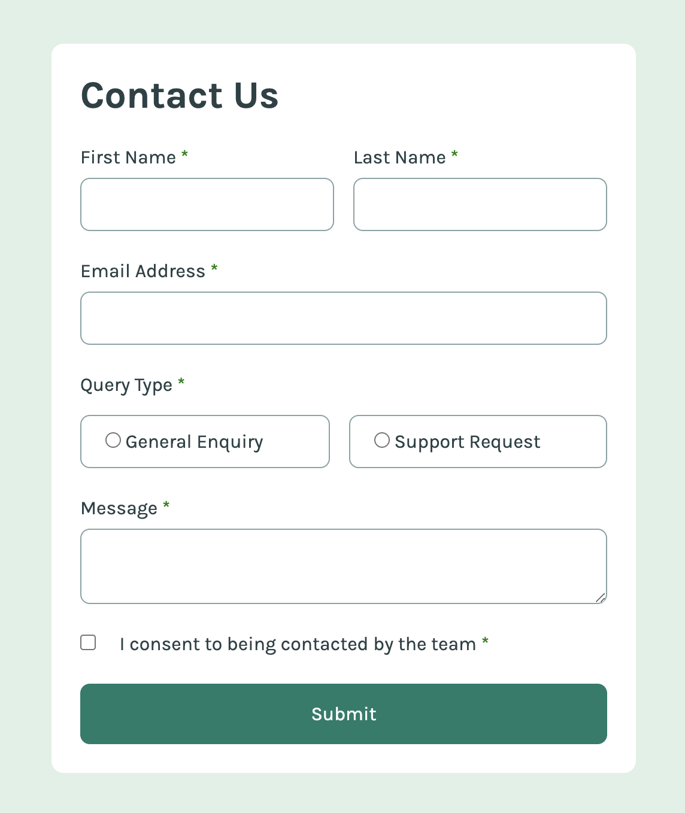

# Frontend Mentor - Contact form solution

This is a solution to the [Contact form challenge on Frontend Mentor](https://www.frontendmentor.io/challenges/contact-form--G-hYlqKJj). Frontend Mentor challenges help you improve your coding skills by building realistic projects.

## Table of contents

- [Overview](#overview)
  - [The challenge](#the-challenge)
  - [Screenshot](#screenshot)
  - [Links](#links)
- [My process](#my-process)
  - [Built with](#built-with)
  - [What I learned](#what-i-learned)
  - [Continued development](#continued-development)
- [Author](#author)
- [Acknowledgments](#acknowledgments)

## Overview

### The challenge

Users should be able to:

- Complete the form and see a success toast message upon successful submission
- Receive form validation messages if:
  - A required field has been missed
  - The email address is not formatted correctly
- Complete the form only using their keyboard
- Have inputs, error messages, and the success message announced on their screen reader
- View the optimal layout for the interface depending on their device's screen size
- See hover and focus states for all interactive elements on the page

### Screenshots

 
Screenshot

 
Screenshot with errors

 
Submit demo

### Links

- Solution URL: [https://www.frontendmentor.io/solutions/contact-form-using-serverside-validation-and-netlify-functions-J5MxouxaXX](https://www.frontendmentor.io/solutions/contact-form-using-serverside-validation-and-netlify-functions-J5MxouxaXX)
- Live Site URL: [https://frontend-mentor-contact-form.netlify.app/](https://frontend-mentor-contact-form.netlify.app/)

## My process

### Built with

- Semantic HTML5 markup
- SCSS
- [Netlify Functions](https://docs.netlify.com/functions/get-started/?fn-language=ts) - for server-side validation
- TypeScript

### What I learned

This was my first experience using Netlify Functions - which are basically just serverless functions - to do server-side form validation. It was quite easy to set up once I faffed around a bit, and I'm satisfied with the outcome.

It was also my first time trying out GitHub Copilot on a personal project. It was a little slow to start off with, but became quite a good productivity tool once some code was already added, as it was context-aware enough to figure out what I wanted to type without me having to give it too many hints. Its chatbot is quite fun to play around with too.

### Continued development

I'd like to refactor my code to make it more functional, so that I can ultimately unit test it. I have a terrible habit on personal projects of neglecting automated tests, and it'd be good to get into the habit of writing code with fewer side-effects.

## Author

- GitHub - [james-frontend-mentor-projects](https://github.com/james-frontend-mentor-projects)
- Frontend Mentor - [@james-work-account](https://www.frontendmentor.io/profile/james-work-account)
